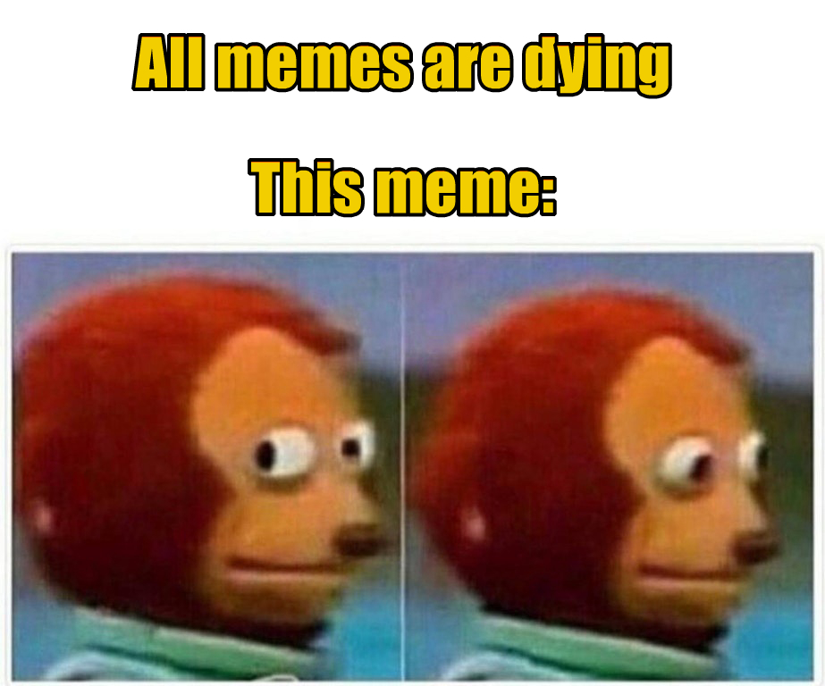

# Light-weight CLI to generate meme from image

## Example :

To convert a image to meme locally

`mkmeme create-meme  "New Feature|Developers" -i "sample/input.jpg" -o 'sample/output.jpg' -s 1.6 -p "20|500" -a 'C'`

To convert an online image to meme

`mkmeme create-meme  "All memes are dying|This meme:" -i "https://i.imgflip.com/2gnnjh.jpg" -p "10|150"`

## Command 
`mkmeme create-meme <text>`

where `<text>` contains multiple lines delimited by `|` symbol

## Options:

| Short Flag | Long Name |Type | Description |
| ----------- | ----------- | ----------- | ----------- |
| -i | --imagein | string | Input Image - provide path| 
| -o | --imageout | string | Output Image - provide path|
| -s | --scale | float | Multiplier to adjust the image zoom/scale. Default is 1 |
| -p | --position | string  | Provide values seperated by pipe symbol to place the text at the respective Y-coordinate |
| -a | --align | string | Provide a alignment value. Default is center (C) . Possible values are [L,C,R]|

`mkmeme create-meme  "New Feature|Developers" -i "sample/input.jpg" -o 'sample/output.jpg' -s 1.6 -p "20|500" -a 'C'`
## Before:

## After:

*From the internet*

`mkmeme create-meme  "All memes are dying|This meme:" -i "https://i.imgflip.com/2gnnjh.jpg" -p "10|150"`

## More Examples

1. `mkmeme "When production goes down"`
2. `mkmeme "*PHP" -i "https://cdn.ebaumsworld.com/mediaFiles/picture/718392/85780332.jpg" -p ",560"`
3. `mkmeme "Who drank the milk|*me" -p "10|[200,200]" -a "C"`
4. `mkmeme "Who drank the milk|*me" -p "10|[200,200]" -a "C" -f "opensans-black"`

## To Contribute:

1. Fork this repository and `cd` into the directory
2. Do `npm i -g`
3. Run the test command to generate a sample MEME
4. Create a feature branch and start making changes
5. Once you are done, raise a PR. 
6. Changes (if any) will be suggested. Kindly make the necessary changes.
7. Upon approval, PR will be merged !!! 🎉

Contributions are welcome !
