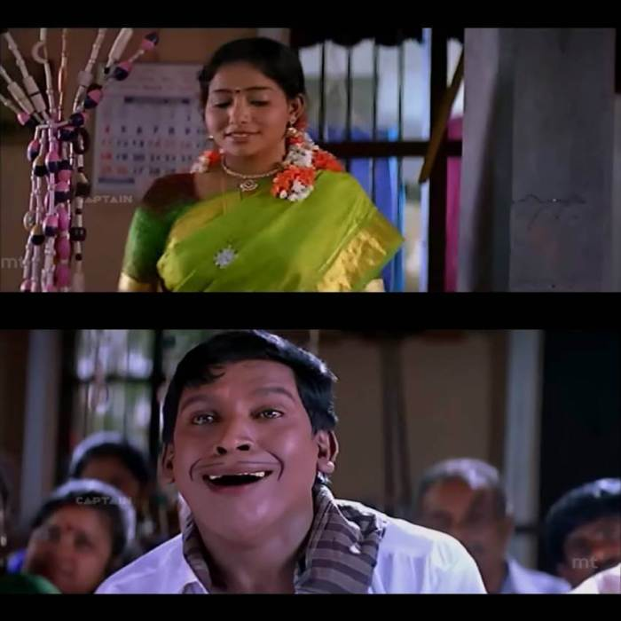

## Light-weight CLI to generate meme from image

Test:

`mkmeme create-meme  "New Feature|Developers" -i "sample/input.jpg" -o 'sample/output.jpg' -s 1.6 -p "20|500" -a 'C'`

Options:

'mkmeme create-meme <text>'
  - '-i, --imagein [imagepath]' -> 'Base Image'
  - '-o, --imageout [imagepath]' -> 'Output Image'
 - '-s, --scale [number]' -> 'Provide a value from 0 to 1 to adjust the image scale'
 -  '-p, --position [number]' -> 'Provide a value from 0 to 1 to adjust the image scale'
- '-a, --align [L,C,R]' -> 'Provide a alignment value. Default is center (C)'

Before:

After:

To Contribute:

1. Fork this repository and `cd` into the directory
2. Do `npm i -g`
3. Run the test command to generate a sample MEME
4. Create a feature branch and start making changes
5. Once you are done, raise a PR. 
6. Changes (if any) will be suggested. Kindly make the necessary changes.
7. Upon approval, PR will be merged !!! 🎉

Contributions are welcome !
